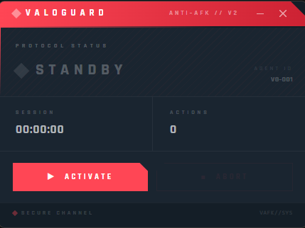

# ValoGuard

  


Never get AFK penalties again by using ValoGuard, the best anti-AFK optimized for VALORANT.

#
# Preview

## APP

### MAIN



# Requirements

- [x] ~50 MB RAM
- [x] ~15 MB disk space
- [x] Windows 10/11 (WebView2 required — included with Windows 11, auto-installed on Windows 10)

# Usage

1. Download `ValoGuard.exe` from the latest [releases](https://github.com/qode4you/ValoGuard/releases/tag/Latest)
2. Run `ValoGuard.exe` — a Valorant-themed window will appear
3. Click **ACTIVATE** to start the anti-AFK bot
4. Click **ABORT** to stop it at any time
5. Close the window (×) to exit completely

# Features

- [x] Valorant-themed native GUI (frameless, non-resizable)
- [x] Real-time session timer and action counter
- [x] Tested in all game modes
- [x] No ban or penalties
- [x] Easy to use — no CLI required

# Future

- [ ] Customizable key bindings
- [ ] Simpler trigger (e.g. F-key or toggle)
- [ ] Tray icon support

# FAQ

**Can I get banned for using ValoGuard?**

Activating macros that trigger actions in the game is bannable, but ValoGuard does not work in a specific pattern and has a realistic reaction time, so Vanguard cannot detect it and the security of your account is guaranteed.

**IMPORTANT:**
Remember, however, that each player is responsible for the actions on his account. If you choose to use ValoGuard, it is your responsibility if you get banned for using it. I do not take any responsibility for any damage caused.

**How do I stop ValoGuard?**

Click **ABORT** in the app, or close the window using the × button in the top-right corner. ValoGuard also stops automatically after 80 minutes.

# Contributing

### Contributions are welcome and encouraged!

#### Development Setup:

```bash
git clone https://github.com/qode4you/ValoGuard
cd ValoGuard
make install   # installs pythonnet (pre-release) + pywebview + keyboard + pyinstaller
make dev       # runs the app in dev mode
make build     # produces dist/ValoGuard.exe via PyInstaller
make clean     # removes build artifacts (dist, build, __pycache__) 
```

**Dependencies:** `pywebview`, `pythonnet`, `keyboard`, `pyinstaller`

#### Project Structure:

```
src/
  main.py          # entry point — pywebview window + API
  valoguard.py     # bot logic — movement, logging, 80-min auto-stop
web/
  index.html       # Valorant-themed UI
  main.js          # session timer, action counter, pywebview bridge
  icon.ico         # app icon
main.spec          # PyInstaller build config
makefile           # dev / build / install shortcuts
```

## License

This project is licensed under the **MIT License** - see the [LICENSE](LICENSE) file for details.

> Made with ♥ by Qode